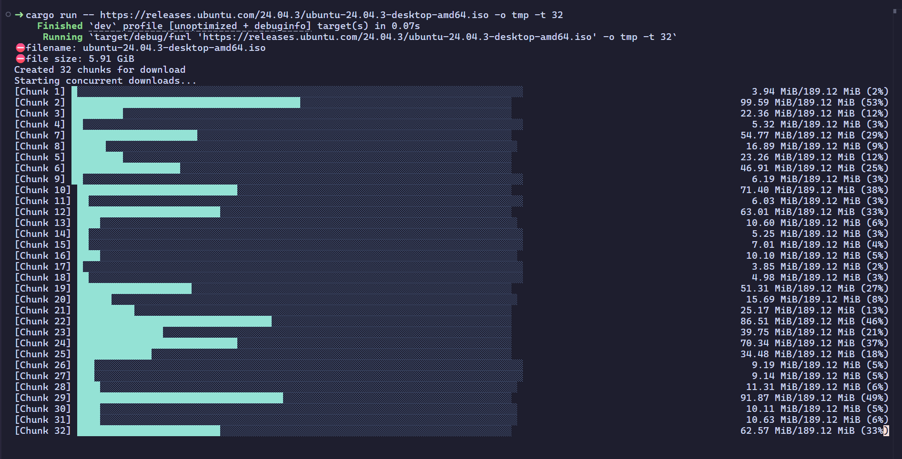

# fURL (`furl-cli`)

A fast, multithreaded CLI downloader built in Rust.

furl is a high-performance command-line tool designed to download files faster
by utilizing multiple threads to fetch chunks of data concurrently. Inspired by
the simplicity of cURL and the robustness of wget.



## ✨ Features

- **Parallel Downloads**: Automatically splits large files into chunks and
  downloads them across multiple threads.
- **Modern Async**: Built on top of `tokio` and `reqwest` for maximum efficiency.
- **Visual Progress**: Beautiful, real-time progress bars using `indicatif`.
- **Rust Powered**: Memory-safe and "fearless" concurrency.

## Installation

### From Crates.io (Recommended)

```bash
cargo install furl-cli
```

### From Source

```bash
git clone https://github.com/ghimiresdp/furl-cli.git
cd furl
cargo build --release
```

## 🛠 Usage

`furl` can be used in 2 modes `Library mode` and `Binary mode`.

### Binary Mode

You need to install the `furl-cli` and add it to the path before you can use it
in the binary mode. For more details, you can check the
[Installation](#installation) section.

#### Without output directory

When no output directory is passed, it automatically downloads the file in the
current terminal directory (PWD).

```bash
furl [URL]
```

**Example:**

```bash
furl https://raw.githubusercontent.com/ghimiresdp/furl-cli/refs/heads/main/res/images/example.png
```

#### With output directory

```bash
furl [URL] -o [path/to/the/directory]
```

**Example:**

```bash
furl https://raw.githubusercontent.com/ghimiresdp/furl-cli/refs/heads/main/res/images/example.png -o ./tmp -t 32
```

### Library Mode

In library mode, you can just import the `Downloader` struct and use its
`download()` method to download files.

```rust
use furl_core::Downloader;

// since Downloader::download() method is async, it needs to be implemented
// inside the async function. if it is main function, we can use
// `#[tokio::main]` macro.

#[tokio::main]
async fn main(){
    let download_url = "https://raw.githubusercontent.com/ghimiresdp/furl-cli/refs/heads/main/res/images/example.png";
    let mut downloader = Downloader::new(download_url);
    if let Ok(_) = downloader.download("/home/user/Downloads", Some(4)).await {
        println!("Download Complete!")
    }
    return;
}
```

## 🗺 Roadmap

- [x] Multithreaded chunk downloading
- [x] Customize number of threads with arguments
- [x] Basic CLI argument parsing (clap)
- [x] Real-time progress bars
- [ ] Resume interrupted downloads (Checkpoints)
- [ ] Support for Proxy and Basic Auth
- [ ] Config file support (furl.toml)

## 🤝 Contributing

Contributions are welcome! Since this project is actively being developed,
please open an issue first to discuss the changes you'd like to make.

1. Fork the Project
2. Create your Feature Branch (`git checkout -b feature/AmazingFeature`)
3. Commit your Changes (`git commit -m 'Add some AmazingFeature'`)`
4. Push to the Branch (`git push origin feature/AmazingFeature`)
5. Open a Pull Request

For more details, please check [CONTRIBUTING.md](CONTRIBUTING.md).

## 📄 License

This project is licensed under the Apache License 2.0.
See the [LICENSE](LICENSE) file for details.

### Third-Party Licenses

This software uses several open-source components. You can view the full list of
dependencies and their licenses using `cargo-license`:

> [!NOTE]
> furl-cli (or fURL) is a successor to my previous project
> [ghimiresdp/rust-raid](https://github.com/ghimiresdp/rust-raid)'s
> [cget](https://github.com/ghimiresdp/rust-raid/tree/main/projects/cget) download manager.
> It incorporates refined logic and improved multithreading from that original
> implementation.
